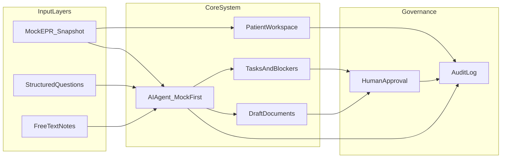
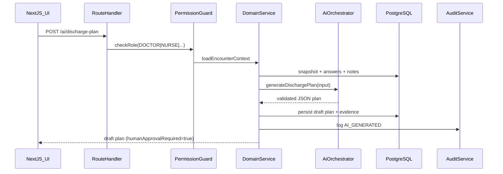
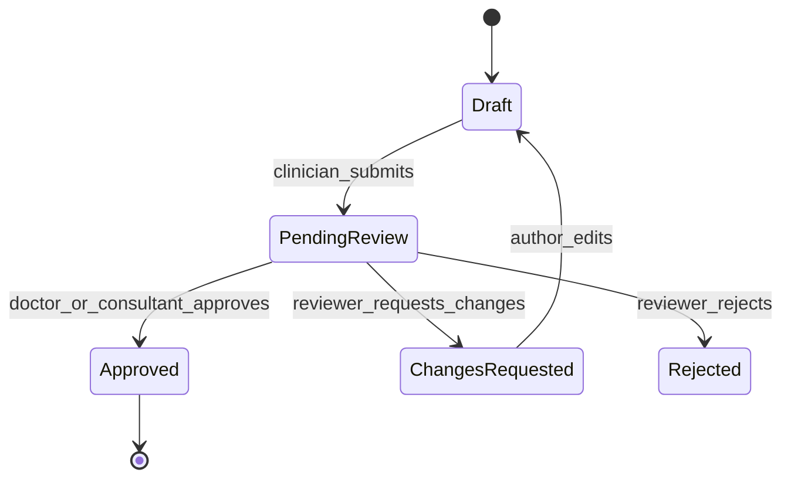

# Discharge AI — MVP Implementation Plan

## 1. Repository assessment

**Current state:** The repo at [`/home/desai/Projects/medtech-hackathon`](/home/desai/Projects/medtech-hackathon) is **greenfield**. The only application artifact is [`README.md`](/home/desai/Projects/medtech-hackathon/README.md) (1,370 lines), which doubles as the product and technical specification. Git history contains a single initial commit. There is no `package.json`, source code, database schema, tests, or CI.

**Implication:** Implementation starts from scratch. The README already defines data models (§10–11), API routes (§15), AI contracts (§12–14), screens (§16), permissions (§19), mock data (§20), tests (§21), and 8 phases (§23). This plan **operationalises** that spec into a concrete file layout, stack choices, and build sequence.

**Confirmed preferences (from you):**
- **AI:** Mock provider by default; optional real LLM via environment variable.
- **Auth:** Seeded dev users + in-app role switcher (no NHS IdP for MVP).

---

## 2. Product interpretation

Discharge AI is a **ward discharge command centre**, not an autonomous clinical decision system.



**MVP delivers one ward** (`Ward 4A — General Medicine`) where clinicians can:
1. See discharge status across patients on a ward dashboard.
2. Open a patient workspace, complete role-specific questionnaires, and add free-text context.
3. Generate an AI **draft** readiness summary and structured discharge plan (tasks, blockers, missing info, uncertainty).
4. Accept/edit/reject AI suggestions; track tasks and blockers with owners.
5. Review draft discharge summary; obtain **explicit human approval** from doctor/consultant.
6. Inspect source evidence and a full audit trail.

**Explicitly out of scope for MVP:** autonomous discharge decisions, EPR writeback, automatic external messaging, medication order changes.

---

## 3. Assumptions

| Area | Assumption |
|------|------------|
| Stack | Next.js 15 App Router, React 19, TypeScript, Tailwind CSS, shadcn/ui |
| Backend | Next.js Route Handlers + service layer in `src/server/` |
| Database | PostgreSQL 16 via Docker Compose; Prisma ORM |
| Auth | Dev session cookie + seeded users; header role switcher for demo |
| AI | `MockAiProvider` default; `OpenAiProvider` when `AI_PROVIDER=openai` and key present |
| EPR | `MockEprAdapter` implementing `EprAdapter` interface; FHIR adapter stub only |
| Ward scope | Single ward, ~10 seeded fictional patients |
| Deployment | Local dev + optional Vercel/Railway; no production NHS deployment claims |
| Compliance | Design **hooks** for DTAC/DSPT/clinical safety; **no compliance claims** |
| Timebox | Hackathon-friendly: Phases 1–5 are demo-critical; 6–8 are stretch |

---

## 4. Proposed architecture

### 4.1 Layered modular monolith

Single Next.js app with strict module boundaries (matching README §9):

```
src/
├── app/                    # Routes, layouts, pages
├── components/             # UI by feature
├── server/
│   ├── modules/            # Domain services (patients, discharge, ai, audit…)
│   ├── integrations/       # EPR adapter interface + mock/FHIR stub
│   ├── ai/                 # Provider abstraction, prompts, schema validation
│   ├── auth/               # Session, RBAC guards
│   └── db/                 # Prisma client
├── lib/                    # Shared utils, enums, zod schemas
└── types/                  # Shared TypeScript types
```

### 4.2 Request flow



### 4.3 Key architectural rules

- **AI never writes `APPROVED` state** — only `DRAFT` / `PENDING_REVIEW`.
- **All AI JSON validated with Zod** before persistence; reject malformed output.
- **Audit events are append-only** — no updates/deletes on `AuditEvent`.
- **Content lifecycle:** `DRAFT → PENDING_REVIEW → APPROVED | REJECTED | CHANGES_REQUESTED`.
- **Integration boundary:** all EPR reads go through `EprAdapter.getClinicalSnapshot()`.

### 4.4 Infrastructure files to add

- [`package.json`](/home/desai/Projects/medtech-hackathon/package.json) — Next.js, Prisma, Zod, Vitest, Playwright
- [`docker-compose.yml`](/home/desai/Projects/medtech-hackathon/docker-compose.yml) — PostgreSQL
- [`.env.example`](/home/desai/Projects/medtech-hackathon/.env.example) — `DATABASE_URL`, `AI_PROVIDER`, optional `OPENAI_API_KEY`
- [`prisma/schema.prisma`](/home/desai/Projects/medtech-hackathon/prisma/schema.prisma) — full data model

---

## 5. Data model

Implement Prisma models aligned with README §10–11. Key refinements for implementation:

### 5.1 Core entities

**User** — `id`, `name`, `email`, `role` (enum), timestamps.

**Patient** — demographics + `nhsNumber`, `hospitalNumber` (indexed, fictional).

**Encounter** — `patientId`, `ward`, `bed`, `specialty`, `consultantName`, `admissionDate`, `expectedDischargeDate`, `dischargeDate`, `status` (enum: `ACTIVE`, `DISCHARGED`, `TRANSFERRED`).

**ClinicalDataSnapshot** — JSON columns for clinical arrays (`diagnoses`, `observations`, `medications`, etc.) + `rawPayload` for adapter fidelity + `sourceSystem`, `capturedAt`.

**DischargeQuestion** — seeded catalog; `domain`, `questionText`, `questionType` (`YES_NO`, `YES_NO_UNKNOWN`, `SELECT`, `TEXT`), `requiredRole`, `isRequired`, `order`.

**DischargeAnswer** — unique per `(questionId, encounterId)`; `value` JSON; `answeredById`.

**FreeTextNote** — append-only clinical context notes.

**DischargePlan** — `generatedBy` enum (`AI`, `HUMAN`); `overallStatus` (DomainStatus); `summary`, `readinessRationale` JSON, `missingInformation` JSON, `safetyConcerns` JSON, `confidence` float; `approvalStatus`; `approvedById`, `approvedAt`.

**DischargeDomainStatus** — child rows per plan/domain.

**DischargeTask** / **Blocker** — linked to encounter + optional `dischargePlanId`; track `ownerRole`, `ownerUserId`, status, priority/severity, escalation metadata.

**DraftDocument** — `type`, `content`, `status`, `generatedBy`, review/approval refs.

**Approval** — polymorphic link to plan or document; `status`, `comments`, `approverId`.

**AuditEvent** — append-only; `eventType`, `entityType`, `entityId`, `before`/`after` JSON, `metadata`, `source` (`HUMAN`, `AI`, `INTEGRATION`, `SYSTEM`).

**SourceEvidence** — links AI statements to EPR/answer/note sources.

**Notification** — draft-only in MVP (status `DRAFT`, never `SENT` by default).

**IntegrationEvent** — EPR sync audit trail.

### 5.2 Enums (Prisma + shared TS)

Use README enums verbatim: `UserRole`, `DischargeDomain`, `DomainStatus`, `TaskStatus`, `BlockerSeverity`, `ApprovalStatus`, `DocumentType`, `AIOutputType`.

Add implementation enums:
- `EncounterStatus`, `ContentSource` (`AI`/`HUMAN`), `AuditSource`, `IntegrationStatus`.

### 5.3 Indexing strategy

- `Encounter(ward, status)` — dashboard queries.
- `DischargeTask(encounterId, status)`, `Blocker(encounterId, status)` — workspace loads.
- `AuditEvent(encounterId, createdAt)` — audit log pagination.

---

## 6. API and service design

### 6.1 Route handlers (Next.js App Router)

| Method | Route | Service | RBAC |
|--------|-------|---------|------|
| GET | `/api/wards/[wardId]/discharge-dashboard` | `DischargeDashboardService` | all clinical roles |
| GET | `/api/patients/[patientId]` | `PatientService` | all |
| GET | `/api/encounters/[encounterId]/discharge-workspace` | aggregates snapshot, plan, tasks, blockers, docs | all |
| GET | `/api/encounters/[encounterId]/questions` | `QuestionnaireService.list` | all |
| POST | `/api/encounters/[encounterId]/answers` | `QuestionnaireService.upsert` | role per question |
| POST | `/api/encounters/[encounterId]/free-text-notes` | `NotesService.create` | doctor/nurse/consultant |
| POST | `/api/encounters/[encounterId]/ai/readiness-summary` | `AiOrchestrator.readinessSummary` | all generate roles |
| POST | `/api/encounters/[encounterId]/ai/discharge-plan` | `AiOrchestrator.dischargePlan` | all generate roles |
| POST | `/api/encounters/[encounterId]/ai/draft-document` | `AiOrchestrator.draftDocument` | doctor/consultant |
| GET/PATCH | `/api/discharge-plans/[id]` | `DischargePlanService` | view all; edit authorised |
| POST | `/api/discharge-plans/[id]/approve` | `ApprovalService.approvePlan` | doctor/consultant only |
| GET/POST/PATCH | `/api/encounters/[id]/tasks`, `/api/tasks/[id]` | `TaskService` | domain-specific |
| GET/POST/PATCH | `/api/encounters/[id]/blockers`, `/api/blockers/[id]` | `BlockerService` | domain-specific |
| GET/PATCH | `/api/documents/[id]` | `DocumentService` | edit per permissions |
| POST | `/api/documents/[id]/approve` | `ApprovalService.approveDocument` | doctor/consultant |
| GET | `/api/encounters/[id]/audit` | `AuditService.list` | all |
| POST | `/api/ai/feedback` | `AiFeedbackService` | all (stretch) |

### 6.2 Domain service interfaces

```typescript
// src/server/integrations/epr/types.ts
interface EprAdapter {
  getClinicalSnapshot(patientId: string, encounterId: string): Promise<ClinicalSnapshotDto>;
  refreshSnapshot(encounterId: string): Promise<ClinicalDataSnapshot>;
}

// src/server/ai/types.ts
interface AiProvider {
  generateReadinessSummary(input: AiInput): Promise<ReadinessSummaryJson>;
  generateDischargePlan(input: AiInput): Promise<DischargePlanJson>;
  generateDraftDocument(input: AiInput, type: DocumentType): Promise<DraftDocumentJson>;
}
```

### 6.3 AI input contract (`AiInput`)

Aggregates: patient, encounter, latest `ClinicalDataSnapshot`, all `DischargeAnswer`s, recent `FreeTextNote`s, existing tasks/blockers, requesting user role, requested output type.

### 6.4 Approval validation rules (server-enforced)

Final plan approval **blocked** when:
- Any domain status is `RED` without documented override comment.
- Required questionnaire fields unanswered for approving role's domains.
- No draft discharge summary in `PENDING_REVIEW` or `APPROVED`.
- `humanApprovalRequired !== false` in latest AI output (always true for MVP).
- Approver role is not `DOCTOR` or `CONSULTANT`.

---

## 7. AI orchestration design

### 7.1 Components

| File | Responsibility |
|------|----------------|
| `src/server/ai/orchestrator.ts` | Builds input, selects provider, validates output, persists drafts |
| `src/server/ai/providers/mock.ts` | Rule-based responses from questionnaire + snapshot (no API key) |
| `src/server/ai/providers/openai.ts` | Optional; gated by env |
| `src/server/ai/prompts/system.ts` | README §13 rules verbatim |
| `src/server/ai/prompts/discharge-plan.ts` | User prompt template with structured context |
| `src/server/ai/schemas/discharge-plan.schema.ts` | Zod schema matching README §14 JSON |
| `src/server/ai/schemas/readiness-summary.schema.ts` | Shorter summary schema |

### 7.2 Mock AI behaviour (default)

Deterministic rules for demo reliability:
- Parse yes/no answers per domain → derive domain status colours.
- Scan free-text for keywords (`TTO`, `OT`, `transport`, `care package`) → create blockers.
- Always set `finalDecisionRequired: true`, `humanApprovalRequired: true`.
- Attach `sourceEvidenceIds` linking to answer IDs and snapshot fields.
- Include `uncertainty[]` when medical fitness question unanswered or marked unknown.

### 7.3 Real LLM path (optional)

When `AI_PROVIDER=openai`:
- Use structured output / JSON mode with Zod validation + single retry on schema failure.
- Log raw prompt/response hashes in `AuditEvent.metadata` (not full PHI in logs by default).
- Same persistence path as mock — no special privileges.

### 7.4 Sample output schema (Zod + JSON Schema export)

Matches README §14 shape:

```json
{
  "overallStatus": "AMBER",
  "summary": "string",
  "readinessRationale": [{ "statement": "string", "type": "fact|suggestion", "sourceEvidenceIds": ["string"] }],
  "domains": [{ "domain": "MEDICAL_READINESS", "status": "AMBER", "ownerRole": "DOCTOR", "summary": "string", "actionRequired": "string", "rationale": "string", "confidence": 0.72, "sourceEvidenceIds": ["string"] }],
  "tasks": [{ "domain": "MEDICINES", "title": "string", "description": "string", "status": "NOT_STARTED", "ownerRole": "PHARMACIST", "priority": "HIGH", "dueAt": null }],
  "blockers": [{ "domain": "THERAPY_AND_MOBILITY", "title": "string", "description": "string", "severity": "HIGH", "status": "BLOCKED", "ownerRole": "OCCUPATIONAL_THERAPIST", "escalationRoute": "string" }],
  "missingInformation": [{ "domain": "FAMILY_COMMUNICATION", "question": "string", "requiredRole": "NURSE", "priority": "MEDIUM" }],
  "safetyConcerns": [{ "domain": "MEDICINES", "concern": "string", "severity": "MEDIUM", "recommendedAction": "string" }],
  "draftDocuments": [{ "type": "DISCHARGE_SUMMARY", "title": "string", "content": "string" }],
  "confidence": 0.68,
  "uncertainty": ["string"],
  "finalDecisionRequired": true,
  "humanApprovalRequired": true
}
```

### 7.5 AI → persistence mapping

On successful generation:
1. Create `DischargePlan` (status `DRAFT`).
2. Upsert `DischargeDomainStatus` rows.
3. Create **proposed** tasks/blockers with flag `proposedByAi: true` (or separate staging table) until user accepts.
4. Create `SourceEvidence` rows from referenced IDs.
5. Write `AuditEvent` type `AI_DISCHARGE_PLAN_GENERATED`.

User actions: **Accept** (persist as active tasks/blockers), **Edit** (human-modified copy + audit), **Reject** (discard proposal + audit).

---

## 8. Frontend UX plan

### 8.1 Design principles

- NHS ward-friendly: high information density, colour-coded domain status, minimal clicks.
- Every AI element labelled **"AI draft — requires clinician review"**.
- Blockers visible within 1 click from dashboard.
- Role switcher in app header for hackathon demos.

### 8.2 Screen map

| Route | Screen | Priority |
|-------|--------|----------|
| `/` | Redirect to ward dashboard | P0 |
| `/wards/[wardId]` | Ward discharge dashboard | P0 |
| `/encounters/[encounterId]` | Patient discharge workspace (tabbed) | P0 |
| `/encounters/[encounterId]/questionnaire` | Structured forms by domain | P0 |
| `/encounters/[encounterId]/plan` | AI discharge plan view | P0 |
| `/encounters/[encounterId]/documents/[docId]` | Draft document review | P1 |
| `/encounters/[encounterId]/approval` | Final approval screen | P0 |
| `/encounters/[encounterId]/audit` | Audit log | P1 |

### 8.3 Component breakdown

**Dashboard:** `WardSelector`, `PatientDischargeTable`, `StatusFilterChips`, `BlockedPatientsPanel`, `AwaitingActionPanel`, `DomainStatusBadge`.

**Workspace tabs:** Summary | Questionnaire | AI Plan | Tasks & Blockers | Documents | Approval | Audit.

**Shared:** `PatientHeader`, `ClinicalSnapshotPanel`, `SourceEvidencePanel`, `AiContentBanner`, `DomainStatusCard`, `TaskList`, `BlockerList`, `Timeline`, `ApprovalChecklist`, `AuditEventTable`, `RoleSwitcher`.

### 8.4 Status colour system

Map `DomainStatus` → Tailwind tokens: Green/Amber/Red/Grey/Blue with accessible contrast + text labels (not colour-only).

### 8.5 UX flows

**Board round (2 min/patient):** Dashboard → filter "Blocked" → open patient → see main blocker + owner → jump to questionnaire gap or task.

**Discharge plan generation:** Complete key questions → add free text → "Generate AI plan" → review domains → accept tasks → doctor reviews draft summary → final approval.

---

## 9. Safety and governance design

| Control | Implementation |
|---------|----------------|
| Human-in-the-loop | `humanApprovalRequired` enforced server-side; UI cannot bypass |
| RBAC | `requireRole()` middleware on every mutating route |
| AI labelling | `AiContentBanner` on all AI-generated fields |
| No autonomous decisions | AI prompts + Zod schema forbid `overallStatus: GREEN` without qualifier; copy says "may be dischargeable if…" |
| No med changes | No medication API routes; documents are text-only drafts |
| No external send | `Notification.status` defaults `DRAFT`; no send endpoint in MVP |
| Fail-safe EPR | If snapshot stale/missing, show banner + block AI generation until refresh or manual attestation |
| Data minimisation | AI input builder sends only fields needed for discharge coordination |
| Hazard log (concept) | `ClinicalHazardReport` model + `/api/hazard-reports` (stretch Phase 8) |
| AI feedback | `AiFeedback` model: accepted/edited/rejected + reason |
| Policy rules | `src/server/policy/discharge-policy.ts` — configurable blockers for approval |

---

## 10. Audit and approval design

### 10.1 Audit events (minimum set)

`WORKSPACE_VIEWED`, `ANSWER_UPSERTED`, `FREE_TEXT_NOTE_CREATED`, `AI_READINESS_GENERATED`, `AI_PLAN_GENERATED`, `AI_SUGGESTION_ACCEPTED`, `AI_SUGGESTION_EDITED`, `AI_SUGGESTION_REJECTED`, `TASK_CREATED`, `TASK_UPDATED`, `BLOCKER_CREATED`, `BLOCKER_RESOLVED`, `DOCUMENT_EDITED`, `DOCUMENT_APPROVED`, `PLAN_APPROVED`, `FINAL_DISCHARGE_APPROVAL`.

Each event: `actorId`, `encounterId`, `entityType`, `entityId`, `before`/`after`, `source`, `metadata` (AI model id, provider name).

### 10.2 Approval workflow



Separate approval tracks for **DischargePlan** and **DraftDocument** (discharge summary). Final approval screen requires both plan + summary approved, no unresolved RED blockers (or explicit override with comment).

### 10.3 Override tracking

When approver proceeds despite RED blocker: require mandatory comment → `AuditEvent` type `APPROVAL_OVERRIDE` with blocker IDs.

---

## 11. MVP implementation phases

### Phase 1 — Foundation (Day 1)
- Scaffold Next.js + Tailwind + shadcn/ui.
- Docker PostgreSQL + Prisma schema + migrate.
- Seed users, questions, 10 patients, clinical snapshots.
- Dev auth + role switcher.
- Audit service + base middleware.

**Exit:** App boots; DB seeded; can authenticate as doctor/nurse.

### Phase 2 — Dashboard + workspace shell (Day 1–2)
- Ward dashboard API + UI with filters.
- Patient workspace layout + clinical snapshot panel.
- Task/blocker CRUD (manual, no AI yet).

**Exit:** Board-round view works with seeded data.

### Phase 3 — Questionnaire + notes (Day 2)
- Question catalog UI with role gating.
- Answer persistence + free-text notes.
- Audit on all writes.

**Exit:** Clinician can complete structured inputs.

### Phase 4 — AI service (Day 2–3)
- Mock AI provider + orchestrator + Zod validation.
- Readiness summary + discharge plan generation endpoints.
- AI plan UI with accept/edit/reject.
- Source evidence panel.

**Exit:** End-to-end AI draft plan from inputs.

### Phase 5 — Task/blocker sync (Day 3)
- Map accepted AI output → persisted tasks/blockers.
- Dashboard reflects AI-derived blockers.
- Escalation metadata + stale blocker highlighting.

**Exit:** "What is blocking discharge?" is accurate.

### Phase 6 — Documentation assistant (Day 3–4)
- Draft discharge summary generation.
- Document review/edit UI.
- Document approval flow.

**Exit:** Draft summary reviewable and approvable.

### Phase 7 — Final approval + audit UI (Day 4)
- Approval checklist screen.
- Server-side approval guards + safety tests.
- Full audit log UI.

**Exit:** MVP Definition of Done (README §24) met.

### Phase 8 — Polish + metrics (stretch)
- Metrics event instrumentation.
- AI feedback capture.
- Hazard log concept.
- Board-round UX polish.

---

## 12. File-by-file implementation plan

### Root / config
- `package.json`, `tsconfig.json`, `next.config.ts`, `tailwind.config.ts`
- `docker-compose.yml`, `.env.example`, `.gitignore`
- `vitest.config.ts`, `playwright.config.ts`

### Database
- `prisma/schema.prisma` — all models + enums
- `prisma/seed.ts` — users, questions (~35), 10 patients, snapshots, partial answers
- `prisma/seed/` — `patients.ts`, `questions.ts`, `clinical-snapshots.ts`

### Server modules
- `src/server/db/client.ts`
- `src/server/auth/session.ts`, `dev-users.ts`, `permissions.ts`
- `src/server/modules/patients/`, `encounters/`, `dashboard/`
- `src/server/modules/questionnaire/`, `notes/`
- `src/server/modules/discharge-plan/`, `tasks/`, `blockers/`, `documents/`
- `src/server/modules/approval/`, `audit/`
- `src/server/integrations/epr/adapter.ts`, `mock-adapter.ts`, `fhir-adapter.stub.ts`
- `src/server/ai/orchestrator.ts`, `providers/mock.ts`, `providers/openai.ts`
- `src/server/ai/prompts/`, `schemas/`
- `src/server/policy/discharge-policy.ts`

### API routes (`src/app/api/...`)
- One `route.ts` per endpoint listed in §6.1

### Frontend pages (`src/app/...`)
- `layout.tsx` — app shell, role switcher, nav
- `wards/[wardId]/page.tsx`
- `encounters/[encounterId]/page.tsx` + sub-routes

### Components (`src/components/`)
- `dashboard/`, `workspace/`, `questionnaire/`, `ai-plan/`, `documents/`, `approval/`, `audit/`, `ui/` (shadcn)

### Tests
- `src/server/**/__tests__/` — unit tests
- `tests/integration/` — API workflow tests
- `tests/safety/` — approval guard tests
- `tests/e2e/` — Playwright critical paths

---

## 13. Testing strategy

### Unit (Vitest)
- `discharge-policy.test.ts` — approval blocked when RED blockers exist
- `permissions.test.ts` — nurse cannot approve plan
- `discharge-plan.schema.test.ts` — rejects invalid AI JSON
- `mock-ai-provider.test.ts` — deterministic output from fixture inputs
- `audit.service.test.ts` — append-only writes

### Integration (Vitest + test DB)
- Submit answers → generate plan → accept tasks → approve (happy path)
- Reject AI plan → no tasks persisted
- Malformed AI response → 422, no DB writes
- Dashboard aggregation counts

### Safety tests (required)
- Cannot set `approvalStatus=APPROVED` via AI endpoint
- Final approval returns 403 for nurse role
- Final approval returns 409 when required questions missing
- No `Notification` reaches `SENT` status via API
- Audit event exists for every AI generation and approval attempt

### E2E (Playwright)
- Dashboard loads 10 patients
- Questionnaire save persists
- Generate AI plan shows uncertainty banner
- Approval screen blocks without summary approval
- Audit log shows generation + approval events

---

## 14. Mock data strategy

Seed **10 fictional patients** per README §20 scenarios:

1. Ready except TTO  
2. Ready except transport  
3. Awaiting OT stair assessment  
4. Awaiting care package  
5. Awaiting consultant review  
6. Awaiting family communication  
7. Not medically fit  
8. Complex care home discharge  
9. High-risk medication counselling  
10. Likely discharge tomorrow  

Each includes: demographics, ward/bed (`4A-01`…), consultant, diagnosis, NEWS2, meds, therapy/nursing notes, social context, `ClinicalDataSnapshot`, partial questionnaire answers, 1+ `SourceEvidence`, mixed task/blocker states.

**Naming:** obviously fictional (e.g. "Jane Demo", NHS numbers in test range).

**Refresh script:** `npm run db:seed` idempotent via upsert.

---

## 15. Risks and open questions

### Technical risks
- **AI non-determinism** (if real LLM enabled) — mitigated by mock default + schema validation.
- **Scope creep** — strict phase gates; communication assistant stays draft-only stub in MVP.
- **Hackathon time** — Phases 1–5 = demo; 6–7 required for "done"; 8 optional.

### Clinical safety risks
- Users misinterpreting AI status as clinical decision — mitigated by labelling, `humanApprovalRequired`, training copy.
- Stale EPR snapshot — mitigated by `capturedAt` display + stale banner.
- Incomplete questionnaire driving wrong plan — mitigated by missing-information section + approval guards.

### Open questions (production; not blocking MVP)
- Real EPR/FHIR vendor and IG approval path
- NHS identity provider (Azure AD, CIS2, etc.)
- Approved AI vendor for PHI processing
- Local trust discharge summary policy
- Which roles may override RED blockers in production

### Success metrics instrumentation (Phase 8)
Event table `MetricEvent` or analytics hooks: `discharge_delay`, `blocker_count_by_hour`, `ai_suggestion_outcome`, `time_to_tto`, `approval_duration`. Dashboard admin view optional.

---

## 16. Recommended next step

**Upon your approval of this plan:**

1. Run Phase 1 scaffold: `create-next-app` + Prisma + Docker Compose + seed script.
2. Implement dev auth role switcher and audit foundation first (safety infrastructure before AI).
3. Build dashboard + workspace with mock data only (no AI) to validate UX.
4. Add Mock AI provider and wire accept/edit/reject flow.
5. Complete approval guards + safety tests before hackathon demo.

No code will be written until you explicitly approve this plan.
