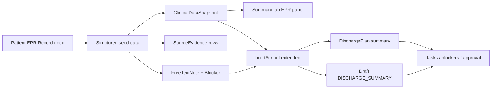

# Import Patient EPR Record and Integrate AI Summary Workflow

## Context from your document

The attached [`Patient EPR Record.docx`](file:///mnt/c/Users/desai/Downloads/Patient%20EPR%20Record.docx) is a **fictional mock EPR** for an **85-year-old male** admitted **1 Jan 2026** with **ruptured acute cholecystitis**, emergency open cholecystectomy, incidental **13mm right renal mass**, and a discharge pathway blocked by **package of care (POC) not yet confirmed** (district nurses: 3-day delay, out of catchment). Daughter **Lucy** is NOK; patient lives alone (wife recently deceased).

This maps cleanly to the app’s existing discharge domains:

| EPR content | Discharge domain | Expected AI/workflow signal |
|---|---|---|
| MFFD on ward round (2–3 Jan) | MEDICAL_READINESS | GREEN/AMBER |
| Pharmacy reconciled; TTO prep implied | MEDICINES | AMBER until TTO screened |
| PT: independent mobilisation by 3 Jan | THERAPY_AND_MOBILITY | GREEN |
| POC delayed 3 days; catchment issue | HOME_AND_CARE | **RED blocker** |
| Daughter involved; wants extra inpatient days | FAMILY_COMMUNICATION | AMBER |
| CT renal mass → urology follow-up | MEDICAL_READINESS / pendingInvestigations | safety flag in summary |

**Current gap:** seed snapshots only store basic fields; `imagingReports` and `bloodResults` are empty, the Summary tab shows only diagnoses/NEWS2/allergies, and [`buildAiInput()`](src/server/modules/discharge-plan/discharge-plan.service.ts) passes only a **subset** of snapshot fields to AI (not imaging, bloods, or ward notes). Your rich EPR would be invisible to both UI and mock AI unless we wire it in.



---

## 1. Add structured EPR data module (extracted from your docx)

Create [`prisma/data/arthur-mockwell-epr.ts`](prisma/data/arthur-mockwell-epr.ts) containing the parsed content as typed constants (no runtime docx dependency required for normal dev):

- **Patient:** Arthur Mockwell, NHS `9990001011`, hospital `H011`, male, DOB ~1940-03-12, lives alone
- **Encounter:** `enc-H011`, ward `4A`, bed `11`, specialty `General Surgery`, consultant **Mr R. Marks**, admission **2026-01-01**, expected discharge **2026-01-04**
- **ClinicalDataSnapshot** (`snap-H011`):
  - `diagnoses`: ruptured acute cholecystitis (post-op), incidental renal mass under investigation
  - `problemList`: biliary colic, HTN, CKD3, T2DM, AF, bilateral TKR, anxiety
  - `observations`: latest stable obs from 3 Jan notes
  - `news2Score`: ~2 (stable post-op)
  - `bloodResults`: Hb 82–102, WCC 25→improving, CRP 173→improving, eGFR 34
  - `imagingReports`: CT Abdomen/Pelvis (1 Jan) + CT Angiogram (1 Jan) with full conclusions from doc
  - `currentMedications`: metformin, amlodipine, bisoprolol, paracetamol, vitamin D (diazepam removed per pharmacy)
  - `allergies`: lorazepam
  - `therapyNotes`: PT notes (2–3 Jan mobilisation progression)
  - `nursingNotes`: key nursing entries (POC delay, daughter contact)
  - `socialHistory`: `{ livesAlone: true, nok: "Lucy (daughter)", wifeDeceased: true }`
  - `pendingInvestigations`: CT renal / urology follow-up for 13mm mass
  - `rawPayload`: chronological array of all note entries from the docx (timestamp, author, role, text) for full fidelity

Optional helper: [`scripts/extract-epr-docx.ts`](scripts/extract-epr-docx.ts) that reads the docx from a configurable path and regenerates the TS module — useful if you update the Word file later. Normal `db:seed` will use the committed TS constants.

---

## 2. Extend [`prisma/seed.ts`](prisma/seed.ts)

Add Arthur as an **11th patient** (does not disturb Jane Demo `enc-H001` E2E fixtures):

- Upsert patient, encounter, snapshot, multiple **SourceEvidence** rows (e.g. CT report, operative note, ward-round MFFD, pharmacy note)
- **FreeTextNote:** POC delay excerpt from nursing note (13:00, 2 Jan)
- **DischargeAnswer** pre-seeds aligned with EPR:
  - Medically fit: **yes**
  - Package of care required: **yes**
  - Package of care confirmed: **no**
  - OT/PT cleared: **yes** (by 3 Jan)
  - NOK updated: **yes**
- **Blocker** `blk-H011`: “Care package not confirmed — district nurses 3-day delay” (`HOME_AND_CARE`, `DISCHARGE_COORDINATOR`, HIGH)

After implementation: `npm run db:seed` → open `/encounters/enc-H011`.

---

## 3. Surface the EPR report in the workspace UI

Update [`src/components/workspace/patient-workspace.tsx`](src/components/workspace/patient-workspace.tsx) Summary tab:

- Expand **Clinical snapshot (EPR)** card to show:
  - Problem list, medications, frailty
  - **Blood results** table/list
  - **Imaging reports** (modality, date, conclusion)
  - **Clinical notes timeline** from `rawPayload.notes` or merged nursing/therapy notes (collapsible sections)
- Keep existing readiness summary + “Generate AI discharge plan” buttons

This lets you **see the patient report** before triggering AI.

---

## 4. Feed the report into AI generation

### Extend AI input ([`discharge-plan.service.ts`](src/server/modules/discharge-plan/discharge-plan.service.ts))

Change `buildAiInput()` snapshot to include the fields already on the model but currently dropped:

```ts
snapshot: {
  diagnoses, problemList, news2Score, observations,
  bloodResults, imagingReports, currentMedications, allergies,
  therapyNotes, nursingNotes, socialHistory,
  pendingInvestigations, frailtyScore,
  rawPayload, // or a trimmed notes excerpt for token control
}
```

Align [`document.service.ts`](src/server/modules/documents/document.service.ts) `generateDraftDocument` input the same way (it currently passes the raw Prisma object — good, but normalizing both paths avoids inconsistency).

### Enhance mock AI ([`src/server/ai/providers/mock.ts`](src/server/ai/providers/mock.ts))

Add snapshot-aware rules (in addition to existing questionnaire/free-text logic):

- Scan `nursingNotes`, `socialHistory`, and `pendingInvestigations` for POC/care-package keywords → HOME_AND_CARE **RED** + blocker
- Reference **imagingReports** and **bloodResults** in `plan.summary`, `readinessRationale`, and `buildDischargeSummary()` (e.g. post-op cholecystectomy, renal mass follow-up, improving inflammatory markers)
- Add `sourceEvidenceIds` pointing to snapshot-derived evidence where applicable

Mock remains default (`AI_PROVIDER=mock` in [`.env`](.env)); no API key required for hackathon demo.

### OpenAI path (optional, no change required to run)

With `AI_PROVIDER=openai` + key, [`openai.ts`](src/server/ai/providers/openai.ts) already JSON-stringifies `input.snapshot`; richer snapshot data will automatically improve real summaries.

---

## 5. End-to-end workflow verification

Manual walkthrough (document in [`SETUP.md`](SETUP.md) under a new “Arthur Mockwell EPR demo” section):

1. `docker compose up -d && npm run db:seed && npm run dev`
2. Role: **Discharge Coordinator** or **Admin**
3. Ward dashboard → open **Arthur Mockwell** (`enc-H011`)
4. **Summary tab:** verify EPR report sections render
5. **Questionnaire:** confirm/complete remaining domain answers
6. **Generate AI discharge plan** → expect POC blocker + renal follow-up in plan summary
7. **Tasks & blockers:** resolve POC blocker (simulate coordinator confirmation) → status recomputes
8. **Documents:** generate discharge summary → verify EPR content reflected in draft text
9. **Approval:** approve document → final plan approval → check audit log

Optional: add [`tests/e2e/arthur-epr-workflow.spec.ts`](tests/e2e/arthur-epr-workflow.spec.ts) mirroring the Jane Demo test but for `enc-H011` (lower priority than manual demo).

---

## 6. Safety and data handling

- Treat the docx as **fictional mock data** only (consistent with project safety notice)
- Do **not** commit the `.docx` to the repo; only the extracted structured constants
- No real PHI; NHS number stays in fictional `999…` range

---

## Key files to change

| File | Change |
|---|---|
| [`prisma/data/arthur-mockwell-epr.ts`](prisma/data/arthur-mockwell-epr.ts) | New — structured EPR from your docx |
| [`prisma/seed.ts`](prisma/seed.ts) | Seed Arthur + evidence + blocker + answers |
| [`src/server/modules/discharge-plan/discharge-plan.service.ts`](src/server/modules/discharge-plan/discharge-plan.service.ts) | Full snapshot in `buildAiInput` |
| [`src/server/ai/providers/mock.ts`](src/server/ai/providers/mock.ts) | Snapshot-driven summary + POC blocker logic |
| [`src/components/workspace/patient-workspace.tsx`](src/components/workspace/patient-workspace.tsx) | EPR report display |
| [`SETUP.md`](SETUP.md) | Demo walkthrough for `enc-H011` |

---

## Expected outcome

After seeding, you will have a **realistic patient report in PostgreSQL**, visible on the **Summary tab**, driving **AI readiness/plan summaries** and a **draft discharge document** that references cholecystectomy recovery, POC delay, and renal mass follow-up — integrated into the **existing approval workflow** without changing core architecture.
