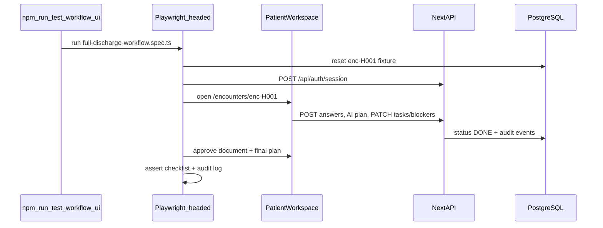

# Task/Blocker Workflow Verification and Full Discharge E2E Test

## Current state (confirmed by code review)

The **resolve workflow is implemented** end-to-end at the API and UI layers:

| Step | Implementation |
|------|----------------|
| UI: mark task done | [`TaskBlockerPanel`](src/components/workspace/task-blocker-panel.tsx) → `PATCH /api/tasks/:taskId` with `{ status: "DONE" }` |
| UI: resolve blocker | Same file → `PATCH /api/blockers/:blockerId` with `{ status: "DONE", notes: "..." }` |
| Server persistence | [`task.service.ts`](src/server/modules/tasks/task.service.ts), [`blocker.service.ts`](src/server/modules/blockers/blocker.service.ts) set `completedAt` / `resolvedAt` |
| Audit | `TASK_UPDATED`, `BLOCKER_RESOLVED` events written |
| Dashboard/checklist | [`dashboard.service.ts`](src/server/modules/dashboard/dashboard.service.ts) and [`discharge-policy.ts`](src/server/policy/discharge-policy.ts) exclude `status: DONE` from active counts |

**Example patient for the test:** **Jane Demo** — stable seeded encounter ID `enc-H001` ([`prisma/seed.ts`](prisma/seed.ts)), scenario “ready except TTO”, pre-seeded blocker `blk-H001` (“TTO not screened”).

**Gaps today:**
- No test covers task/blocker PATCH or the full discharge path
- No `data-testid` hooks (selectors are brittle)
- E2E is not idempotent (re-runs fail once a plan is approved)
- [`TaskBlockerPanel`](src/components/workspace/task-blocker-panel.tsx) lists resolved blockers in the same list (Resolve button hides, but “No active blockers” never shows until the array is empty) — minor UX confusion, worth fixing alongside tests



---

## Implementation plan

### 1. Test fixture reset (idempotent runs)

Add [`tests/helpers/reset-workflow-patient.ts`](tests/helpers/reset-workflow-patient.ts):

- Target encounter: `enc-H001` (Jane Demo)
- Delete per-run artifacts: `DischargePlan`, plan-linked `DischargeTask`/`Blocker`, `DraftDocument`, `Approval`, `AiFeedback`, `SourceEvidence` (for this encounter), extra audit noise if needed
- Restore baseline seed state:
  - Blocker `blk-H001` → `status: BLOCKED`, `resolvedAt: null`
  - Keep clinical snapshot + free-text note
  - Reset TTO answer to `{ answer: "no" }` (matches seed scenario)
- Export `resetJaneDemoEncounter()` for Vitest + Playwright

Wire a npm script: `test:workflow:reset` → `tsx tests/helpers/reset-workflow-patient.ts`

### 2. Vitest integration test (fast CLI confirmation)

Add [`tests/integration/task-blocker-workflow.test.ts`](tests/integration/task-blocker-workflow.test.ts):

- `beforeEach`: call `resetJaneDemoEncounter()`
- Directly invoke services (no browser):
  - `createTask` / `updateTask` → assert `status === "DONE"`, `completedAt` set
  - `createBlocker` / `updateBlocker` → assert `status === "DONE"`, `resolvedAt` set, audit `BLOCKER_RESOLVED`
  - `getApprovalChecklist("enc-H001")` → `activeBlockerCount` decreases after resolve
- Assert seeded `blk-H001` resolves correctly via `updateBlocker("blk-H001", { status: "DONE" }, doctorId)`

Add npm script: `test:integration` → `vitest run tests/integration`

This **confirms correctness** in ~1s without UI.

### 3. Playwright full-discharge workflow (visible on UI)

Add [`tests/e2e/full-discharge-workflow.spec.ts`](tests/e2e/full-discharge-workflow.spec.ts) covering the **full path you selected**:

1. **Reset** Jane Demo encounter
2. **Auth helper** [`tests/e2e/helpers/auth.ts`](tests/e2e/helpers/auth.ts): `POST /api/auth/session` with `user-doctor-1` (sets cookie; avoids role-switcher reload race)
3. Open `/encounters/enc-H001`
4. **Questionnaire tab**: answer pharmacy screen = yes, TTO = yes, family updated = yes (enough to green several domains)
5. **Summary tab**: click “Generate AI discharge plan”
6. **Tasks & blockers tab**:
   - Click every visible `Mark done` / `Resolve`
   - Assert no unresolved action buttons remain
   - Assert checklist API shows `activeBlockerCount === 0` (via `page.request.get`)
7. **Documents tab**: generate discharge summary → Approve document
8. **Approval tab**: check confirmation checkbox → Final approve (use override comment if RED domains remain)
9. **Audit tab**: assert events include `BLOCKER_RESOLVED`, `TASK_UPDATED`, `DOCUMENT_APPROVED`, `FINAL_DISCHARGE_APPROVAL`

Add stable selectors via `data-testid` on key controls (minimal set):

| Element | File | test id |
|---------|------|---------|
| Tab buttons | [`patient-workspace.tsx`](src/components/workspace/patient-workspace.tsx) | `tab-questionnaire`, `tab-tasks`, `tab-documents`, `tab-approval`, `tab-audit` |
| Generate plan | same | `generate-ai-plan` |
| Mark done / Resolve | [`task-blocker-panel.tsx`](src/components/workspace/task-blocker-panel.tsx) | `task-mark-done`, `blocker-resolve` |
| Approve doc / Final approve | workspace + approval panel | `approve-document`, `final-approve-plan`, `approval-confirm` |

### 4. Small UI fix for clearer “active blockers”

In [`task-blocker-panel.tsx`](src/components/workspace/task-blocker-panel.tsx):

- Split lists into **Active** vs **Resolved** (filter `status !== "DONE"`)
- Empty state: “No active blockers” when active list is empty (even if resolved history exists)

This aligns UI with dashboard/checklist logic and makes the Playwright assertions unambiguous.

### 5. CLI scripts and docs

Update [`package.json`](package.json):

```json
"test:integration": "vitest run tests/integration",
"test:workflow": "playwright test tests/e2e/full-discharge-workflow.spec.ts",
"test:workflow:ui": "playwright test tests/e2e/full-discharge-workflow.spec.ts --headed --slow-mo=750",
"test:workflow:reset": "tsx tests/helpers/reset-workflow-patient.ts"
```

Update [`SETUP.md`](SETUP.md) with:

```bash
# Prerequisites: docker compose up -d, db seeded, dev server running (or let Playwright start it)

npm run test:workflow:reset   # optional manual reset
npm run test:integration      # fast API/service verification
npm run test:workflow           # headless full path
npm run test:workflow:ui        # watch Jane Demo complete discharge in browser
```

Update [`playwright.config.ts`](playwright.config.ts):

- Increase default timeout for workflow spec (e.g. 120s)
- Optional env `SLOW_MO` passthrough for `--slow-mo`

### 6. Known approval edge cases (handled in test)

Final approval in [`discharge-policy.ts`](src/server/policy/discharge-policy.ts) may still require:

- Approved discharge summary (test approves document first)
- `overrideReason` if plan has RED domains or HIGH plan-linked blockers

The E2E test will fill override comment when validation preview shows errors — this mirrors real clinician workflow and confirms blockers were truly cleared or explicitly overridden.

---

## Files to add/change

| Action | File |
|--------|------|
| Add | `tests/helpers/reset-workflow-patient.ts` |
| Add | `tests/integration/task-blocker-workflow.test.ts` |
| Add | `tests/e2e/helpers/auth.ts` |
| Add | `tests/e2e/full-discharge-workflow.spec.ts` |
| Edit | `src/components/workspace/task-blocker-panel.tsx` (active/resolved split + test ids) |
| Edit | `src/components/workspace/patient-workspace.tsx` (test ids on tabs/buttons) |
| Edit | `src/components/approval/approval-panel.tsx` (test ids) |
| Edit | `package.json`, `SETUP.md`, `playwright.config.ts` |

---

## How you will run and observe it

**Fast verification (no browser):**
```bash
npm run test:integration
```

**Full workflow, watch in UI:**
```bash
npm run test:workflow:ui
```
Playwright opens Chromium, slows interactions (~750ms), and walks Jane Demo from ward workspace through task/blocker resolution to final approval.

**CI / headless:**
```bash
npm run test:workflow
```

---

## Success criteria

- Integration test proves task/blocker PATCH sets `DONE`, timestamps, and audit events
- After resolve, `activeBlockerCount` is 0 on encounter checklist
- Playwright headed run completes without manual clicks
- Audit log shows `BLOCKER_RESOLVED` and `FINAL_DISCHARGE_APPROVAL`
- Test is idempotent via reset fixture before each run
